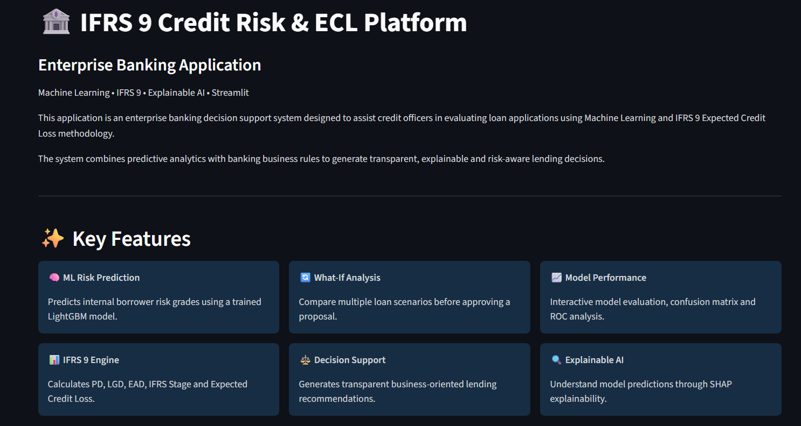
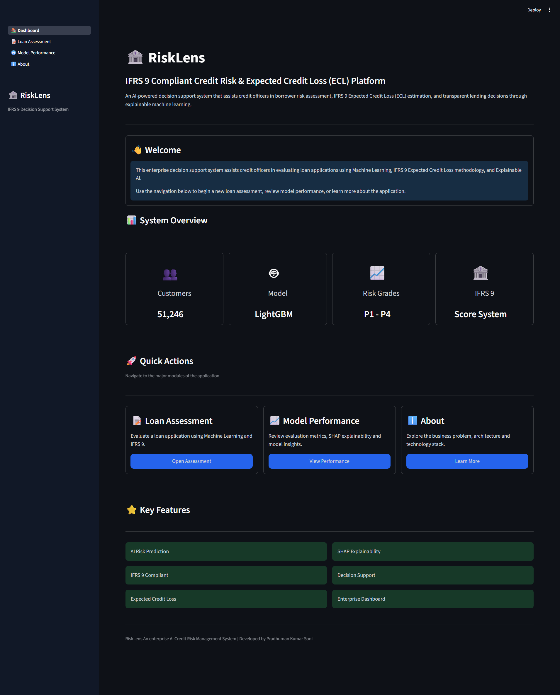
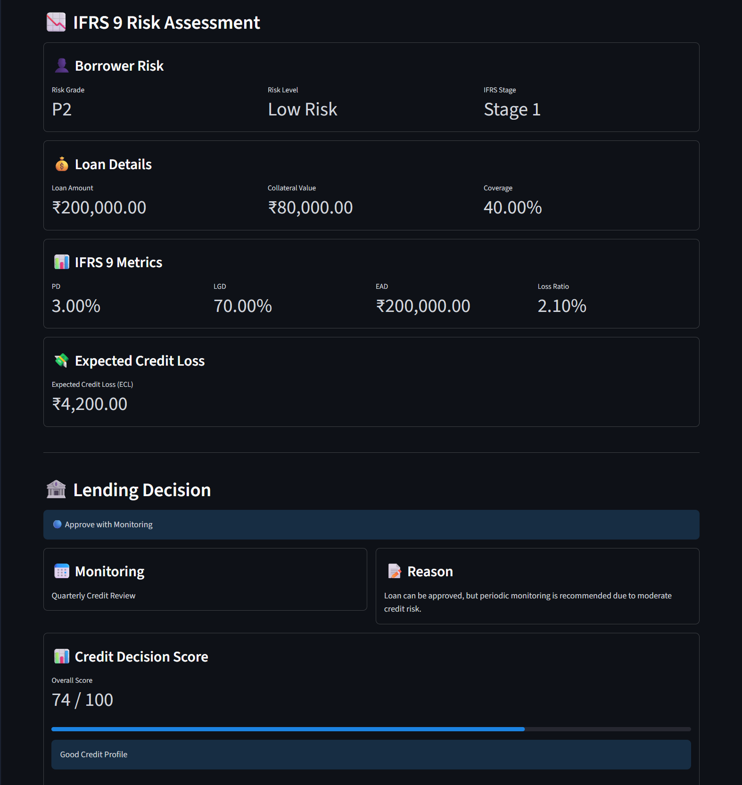
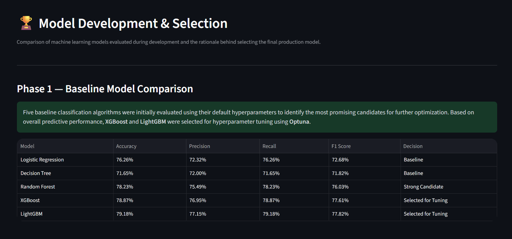
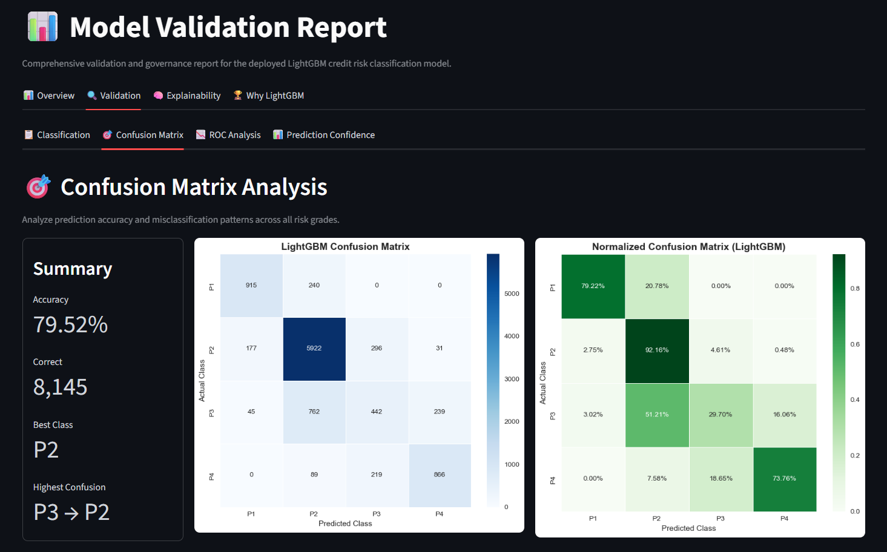
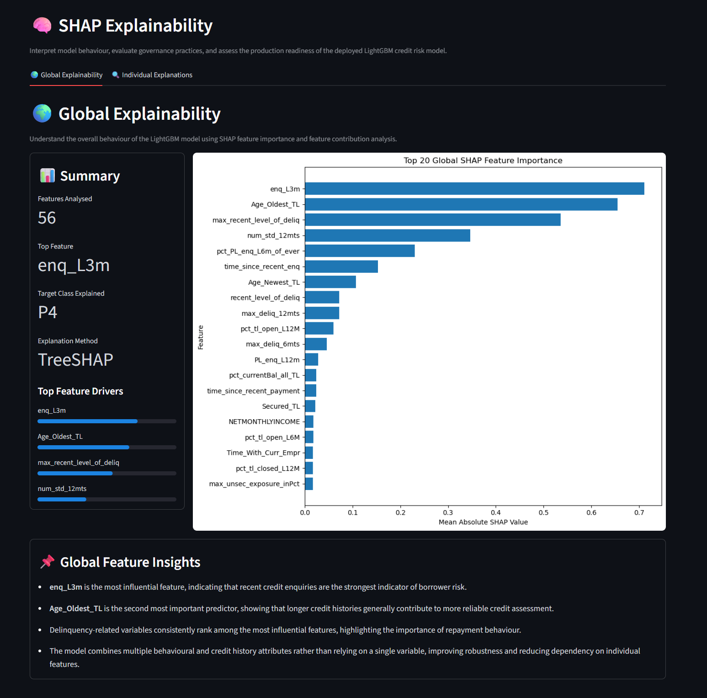
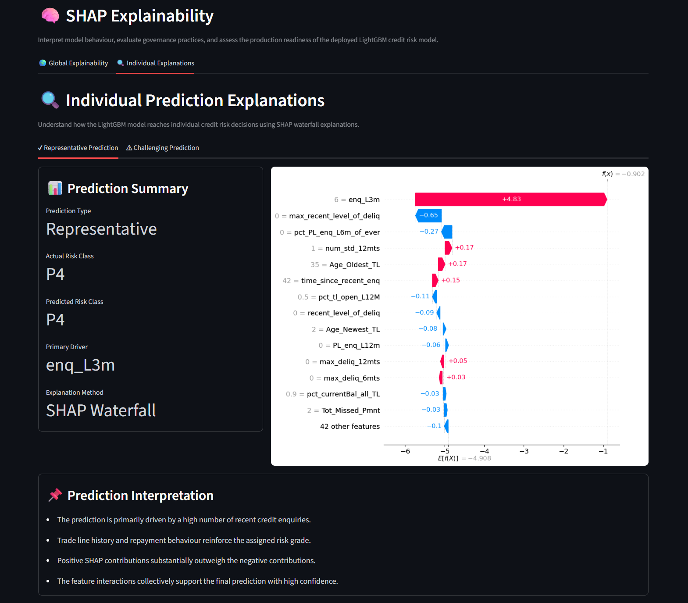

# 🏦 RiskLens

> **An Explainable Machine Learning Platform for IFRS 9 Credit Risk Assessment & Expected Credit Loss (ECL) Estimation**

[]()
[]()
[]()
[]()

## 🚀 Live Demo

### 🌐 Try the Application

**https://risklens-ifrs9-credit-risk-system.streamlit.app/**

> **Note:** The application may take 10–20 seconds to wake up if it has been idle on Streamlit Community Cloud.

---



---

# 📌 Overview

RiskLens is an end-to-end **Machine Learning-powered Credit Risk Decision Support System** that assists credit officers in evaluating loan applications under the **IFRS 9 Expected Credit Loss (ECL)** framework.

The platform combines predictive machine learning, explainable AI (SHAP), and banking business rules to generate transparent, data-driven lending recommendations through an interactive Streamlit application.

---

# ✨ Key Features

- 🤖 LightGBM-based Borrower Risk Prediction
- 📊 IFRS 9 Expected Credit Loss (ECL) Estimation
- 📈 Probability of Default (PD), Loss Given Default (LGD) & Exposure at Default (EAD)
- 🏦 IFRS 9 Stage Classification
- 📋 Credit Decision Support Engine
- 🔄 Interactive What-If Analysis
- 🧠 SHAP Global & Local Explainability
- 📉 Model Performance Dashboard
- 💻 Professional Banking Interface built with Streamlit

---

# 🛠 Tech Stack

| Category | Technologies |
|-----------|--------------|
| Programming Language | Python |
| Machine Learning | LightGBM, Scikit-learn |
| Explainable AI | SHAP |
| Data Processing | Pandas, NumPy |
| Visualization | Plotly, Matplotlib |
| Frontend | Streamlit |

---

# 📸 Application Showcase

## Dashboard

A centralized overview of the platform with quick navigation to all major modules.



---

## Loan Assessment

Search customer profiles, predict borrower risk, estimate IFRS 9 metrics, generate lending recommendations, and perform What-If Analysis.



---

## Model Performance

View model comparison, validation metrics, deployment details, and overall model performance.



---

## Confusion Matrix

Evaluate classification accuracy across all internal credit risk grades.



---

## Global Explainability

Understand the most influential borrower features using SHAP Feature Importance.



---

## Local Explainability

Interpret individual credit decisions with SHAP Waterfall plots.



---

## About

Project overview, architecture, workflow, and implementation details.


---

# 🚀 Installation

```bash
git clone https://github.com/<your-username>/RiskLens.git

cd RiskLens

pip install -r requirements.txt

streamlit run app.py
```

---

# 📂 Project Structure

```text
RiskLens/
│
├── app.py
├── pages/
├── src/
├── models/
├── data/
├── assets/
├── requirements.txt
└── README.md
```

---

# 🎯 Learning Outcomes

This project demonstrates:

- End-to-End Machine Learning Pipeline
- Explainable AI using SHAP
- IFRS 9 Expected Credit Loss Framework
- Credit Risk Classification
- Decision Support System Design
- Streamlit Application Development
- Production-style Project Organization

---

# 📜 Disclaimer

This project was developed for educational and portfolio purposes. The IFRS 9 implementation is a simplified demonstration of credit risk modelling and Expected Credit Loss estimation. It is **not intended for production banking environments** or regulatory compliance.

---

# 👨‍💻 Author

## Pradhuman Kumar Soni

**M.Sc. Mathematics & Scientific Computing**

Aspiring AI Engineer • Machine Learning • Credit Risk Analytics • Financial Modelling • Data Science

---
⭐ If you found this project interesting, consider giving it a star!
